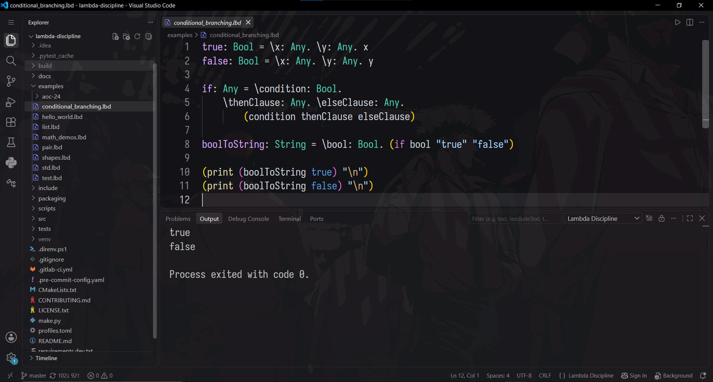

# VS Code extension for Lambda Discipline

VS Code language support for the [Lambda Discipline](https://github.com/lambda-discipline/lambda-discipline) programming language.

## Features

- Syntax highlighting
- `.lbd`, `.lambda` and `.lambda-discipline` file support
- Lambda Discipline file icons
- Run the current file with `lbd run`

## Requirements

The Lambda Discipline interpreter must be installed and available as `lbd` on `PATH`.

## Installation

Download the `.vsix` package and install it through:

`Extensions -> ... -> Install from VSIX...`
